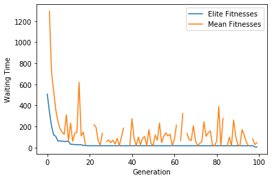
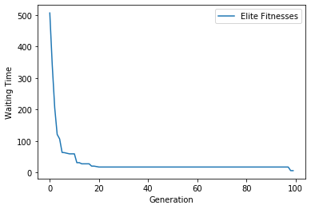

# Waiting time minimization in road traffic using Genetic algorithms

This project demonstrates a usage of a basic genetic algorithm to minimize the waiting time in a 4 way junction with traffic lights. I got the SUMO config files from this [repocitory](https://github.com/MarkJanith/Traffic-Light-Optimization).

 - Python is used with the TraCI library to communicate with SUMO simulator. 
 - Genetic Algorithm is implemented using only the numpy library. 
 - Waiting time as the fitness function

## Results

## References:
 - [Traffic-Light-Optimization](https://github.com/MarkJanith/Traffic-Light-Optimization)
 - [SUMO Tutorials](https://sumo.dlr.de/docs/Tutorials.html)

